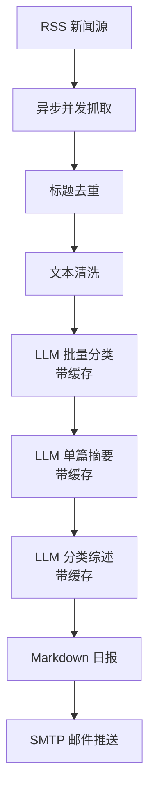

# NewsAgent：一条命令生成你的 AI 新闻早报

NewsAgent 是一个面向个人开发者、团队和内容运营者的 AI 自动化新闻产品。它把 **RSS 抓取、异步并发、标题去重、文本清洗、LLM 分类、单篇摘要、分类综述、Markdown 日报、邮件推送** 串成一个 LangGraph 工作流，实现无人值守的每日简报。

> 这个仓库不只是“能跑的代码”，它是一份可以直接拿去面试演示的产品作品：有明确用户价值、有可演示输出、有成本控制、有测试、有部署入口。

---

## 30 秒看懂产品

**一句话：** 每天自动把分散的新闻源整理成一份分类清晰、有编辑推荐的日报，并通过邮件推送给目标用户。

**目标用户：** 产品经理、运营、开发者、投资研究者、任何需要每天快速掌握行业动态的人。

**核心价值：**

- 从“每天自己刷 20 个网站”变成“每天读一份 10 分钟日报”
- 用缓存避免相同新闻重复调用大模型，降低 Token 成本
- 用 LangGraph 把复杂流程拆成可维护、可观测、可扩展的节点
- 支持定时运行，真正实现无人值守

---

## 立即看产品效果

不需要 API Key、不需要邮箱、不需要联网，一条命令生成演示日报：

```bash
python main/demo_product.py
```

生成文件：

- [examples/demo_report.md](examples/demo_report.md)

这份演示日报已经写入仓库，打开就能直接看产品的最终输出长什么样。

---

## 产品架构



工作流使用 LangGraph `StateGraph` 编排，节点之间的状态通过 `AgentState` 传递；当文章数量超过阈值时，还可以进入额外校验节点。

---

## 真实运行

### 1. 安装依赖

```bash
python -m venv venv

# Windows
venv\Scripts\activate

# Mac / Linux
source venv/bin/activate
```

```bash
uv sync
```

### 2. 配置环境变量

复制 `.env.example` 为 `.env`，填入：

- `DASHSCOPE_API_KEY`：通义千问兼容模式 API Key
- `EMAIL_SENDER`：发件邮箱
- `EMAIL_AUTH_CODE`：邮箱授权码
- `EMAIL_TO`：收件邮箱

### 3. 运行完整流程

```bash
python main/run_graph.py
```

生成的日报默认会保存为 `report.md`，同时也会写入 `report/news_daily_YYYY-MM-DD.md`。

### 4. 定时运行

```bash
python main/auto_run.py
```

GitHub Actions 中也配置了每日定时执行，可在 [.github/workflows/run.yml](.github/workflows/run.yml) 查看。

---

## 项目结构

```text
config/sources.yaml        # RSS 数据源与邮件配置
main/run_graph.py          # 完整工作流入口
main/auto_run.py           # 定时任务入口
main/demo_product.py       # 无需 API 的产品演示入口
src/news_agent/graph.py    # LangGraph 工作流
src/news_agent/nodes/      # 抓取、去重、清洗、分类、摘要、报告、推送
src/news_agent/utils/      # 缓存、日志、文本清理
tests/                     # 配置、环境、核心函数测试
examples/demo_report.md    # 可直接展示的示例日报
docs/INTERVIEW.md          # 面试销售话术与答辩准备
```

---

## 产品亮点

- **LangGraph 流程编排：** 节点、状态、条件路由、checkpoint 都围绕真实业务设计
- **异步并发抓取：** 多个 RSS 源并行获取，缩短单次执行时间
- **AI 缓存机制：** 分类、摘要、分类综述都有本地缓存，避免重复扣费
- **结构化输出：** Markdown 日报可读、可归档、可二次加工
- **无人值守：** 本地定时任务与 GitHub Actions 都支持
- **可演示：** 不需要密钥也能向面试官展示最终产品形态

---

## 面试怎么讲

面试就是销售这个产品，销售顺序建议是：

1. 先说用户痛点：信息过载、人工整理成本高
2. 再说产品结果：一份自动生成的分类日报
3. 再说技术方案：LangGraph + 异步抓取 + LLM + 缓存 + SMTP
4. 最后说工程能力：测试、日志、定时任务、GitHub Actions、成本控制

完整的 30 秒销售话术、常见追问和回答思路，放在：

- [docs/INTERVIEW.md](docs/INTERVIEW.md)

---

## 当前已具备的产品闭环

- 数据获取：RSS 多源异步抓取
- 数据处理：去重、清洗、分类、摘要
- 内容生成：分类日报 + 编辑推荐
- 触达用户：邮件推送
- 自动运行：本地定时 + CI 定时
- 可验证：测试、日志、样例输出

## 可以继续补的下一阶段

- 简单 Web 看板：历史日报、手动触发、导出
- 多平台推送：钉钉、飞书、企业微信、Slack
- 用户反馈：点赞/点踩摘要，用于迭代提示词
- 持久化历史：用 SQLite 或数据库替代 JSON 缓存

这些不是“当前必须重写”的代码，而是产品后续可以讲清楚的增长路径。
